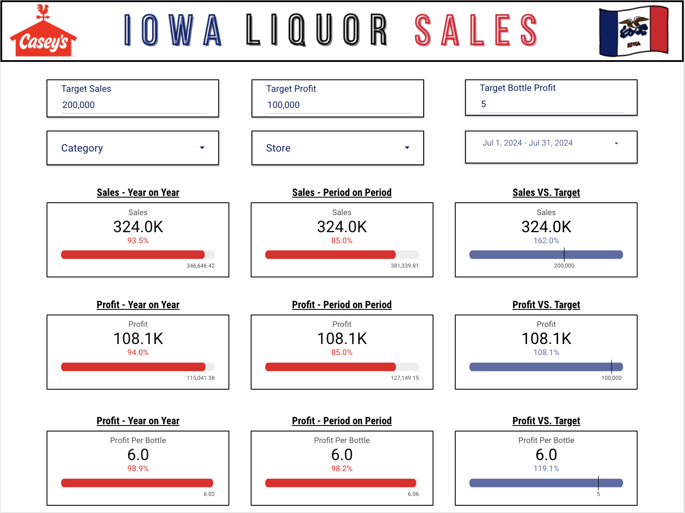

# Iowa-Liquor-Sales-Dashboard

- This project explores Liquor Store Sales (specifically from the general store Casey's) from 2023 up till now. Tons of key concepts from Looker Studio are used in this project. More details on what is used will be listed below!

## Concepts Applied 💻✅
- Calculated Fields
- Parameters
- Control Fields for user interaction
- KPI exploration
- Sharing, Website Publishing

  ## Dashboard Preview 📸📷

  

   

## Tools Used 📊📈

- Google Looker Studio
- Canva For the Theme
- Big Query to extract needed dimensions and metrics
- Google Sheets

Here is the live site (not meant to be the prettiest), just practicing publishing!

[View the site!](https://sites.google.com/view/analyticswgurki/home)

## Overall Takeaway 
This was a decently hard project. With the amount of scorecards and balancing of data, the dashboard can act up. However, although it was tough, it highlighted an area of Looker Studio that I need to work on. Overall, not my proudest work, but I'm happy with the outcome anyway. I'll definitely come back to this dashboard in the future and bring it up to par!
